# 从硬件入手深入理解 epoll  的本质

> 总结：
>
> 从一个点出发：线程是直接监听 socket， 还是监听了封装的 socket 队列。epoll 相对于 selector，不仅可以知道有socket准备好了读写准备，而且知道哪个socket准备好了，用空间换时间，建立一个队列（数组）遍历到了就放入其中，这就比 selector 少一个轮询。

### 一、从网卡接收数据说起

下边是一个典型的计算机结构图，计算机由 CPU、存储器（内存）与网络接口等部件组成，了解 epoll 本质的第一步，要从硬件的角度看计算机怎样接收网络数据。

下图展示了网卡接收数据的过程。

- 在 ① 阶段，网卡收到网线传来的数据；
- 经过 ② 阶段的硬件电路的传输；
- 最终 ③ 阶段将数据写入到内存中的某个地址上。

这个过程涉及到 DMA 传输、IO 通路选择等硬件有关的知识，但我们只需知道：**网卡会把接收到的数据写入内存**。通过硬件传输，网卡接收的数据存放到内存中，操作系统就可以去读取它们。


### 二、如何知道接收了数据？

了解 epoll 本质的第二步，要从 CPU 的角度来看数据接收。理解这个问题，要先了解一个概念——中断。

计算机执行程序时，会有优先级的需求。比如，当计算机收到断电信号时，它应立即去保存数据，保存数据的程序具有较高的优先级（电容可以保存少许电量，供 CPU 运行很短的一小段时间）。

一般而言，由硬件产生的信号需要 CPU 立马做出回应，不然数据可能就丢失了，所以它的优先级很高。CPU 理应中断掉正在执行的程序，去做出响应；当 CPU 完成对硬件的响应后，再重新执行用户程序。中断的过程如下图，它和函数调用差不多，只不过函数调用是事先定好位置，而中断的位置由“信号”决定。

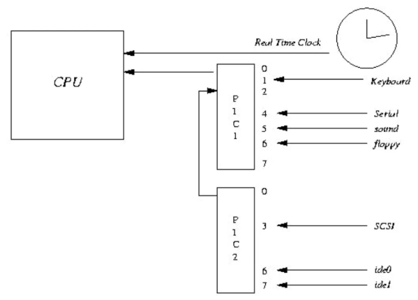


中断程序调用

以键盘为例，当用户按下键盘某个按键时，键盘会给 CPU 的中断引脚发出一个高电平，CPU 能够捕获这个信号，然后执行键盘中断程序。下图展示了各种硬件通过中断与 CPU 交互的过程。

现在可以回答“**如何知道接收了数据？**”这个问题了：当网卡把数据写入到内存后，网卡向 CPU 发出一个中断信号，操作系统便能得知有新数据到来，再通过网卡中断程序去处理数据。


### 三、进程阻塞为什么不占用 CPU 资源？

了解 epoll 本质的第三步，要从操作系统进程调度的角度来看数据接收。

阻塞是进程调度的关键一环，指的是进程在等待某事件（如接收到网络数据）发生之前的等待状态，recv、select 和 epoll 都是阻塞方法。下边分析一下进程阻塞为什么不占用 CPU 资源？

为简单起见，我们从普通的 recv 接收开始分析，先看看下面代码：

```
//创建socket
int s = socket(AF_INET, SOCK_STREAM, 0);   
//绑定
bind(s, ...)
//监听
listen(s, ...)
//接受客户端连接
int c = accept(s, ...)
//接收客户端数据
recv(c, ...);
//将数据打印出来
printf(...)
复制代码
```

这是一段最基础的网络编程代码，先新建 socket 对象，依次调用 bind、listen 与 accept，最后调用 recv 接收数据。recv 是个阻塞方法，当程序运行到 recv 时，它会一直等待，直到接收到数据才往下执行。

那么阻塞的原理是什么？

#### 3.1 工作队列

操作系统为了支持多任务，实现了进程调度的功能，会把进程分为“运行”和“等待”等几种状态。运行状态是进程获得 CPU 使用权，正在执行代码的状态；等待状态是阻塞状态，比如上述程序运行到 recv 时，程序会从运行状态变为等待状态，接收到数据后又变回运行状态。操作系统会分时执行各个运行状态的进程，由于速度很快，看上去就像是同时执行多个任务。

下图的计算机中运行着 A、B 与 C 三个进程，其中进程 A 执行着上述基础网络程序，一开始，这 3 个进程都被操作系统的工作队列所引用，处于运行状态，会分时执行。

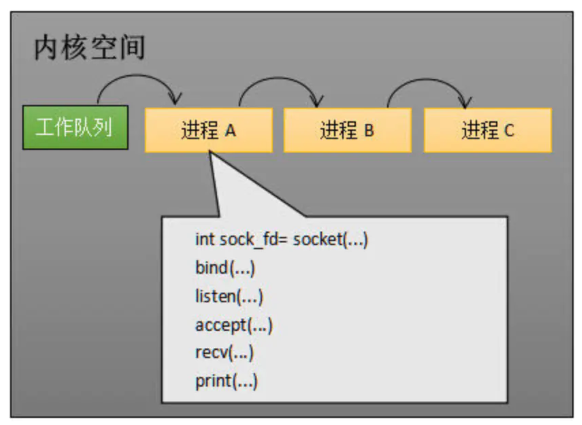


#### 3. 2等待队列

当进程 A 执行到创建 socket 的语句时，操作系统会创建一个由文件系统管理的 socket 对象（如下图）。这个 socket 对象包含了发送缓冲区、接收缓冲区与等待队列等成员。等待队列是个非常重要的结构，它指向所有需要等待该 socket 事件的进程。

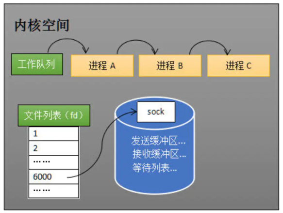

当程序执行到 recv 时，操作系统会将进程 A 从工作队列移动到**该 socket 的等待队列**中（如下图）。由于工作队列只剩下了进程 B 和 C，依据进程调度，CPU 会轮流执行这两个进程的程序，不会执行进程 A 的程序。所以进程 A 被阻塞，不会往下执行代码，也不会占用 CPU 资源。

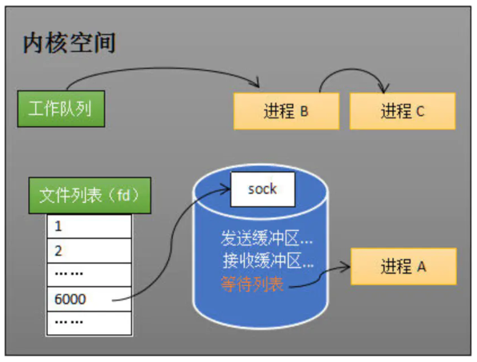


注：操作系统添加等待队列只是添加了对这个“等待中”进程的引用，以便在接收到数据时获取进程对象、将其唤醒，而非直接将进程管理纳入自己之下。上图为了方便说明，直接将进程挂到等待队列之下。


#### 3.3 唤醒进程

当 socket 接收到数据后，操作系统将该 socket 等待队列上的进程重新放回到工作队列，该进程变成运行状态，继续执行代码。同时由于 socket 的接收缓冲区已经有了数据，recv 可以返回接收到的数据。

### 四、内核接收网络数据全过程

这一步，贯穿网卡、中断与进程调度的知识，叙述阻塞 recv 下，内核接收数据的全过程。

如下图所示，进程在 recv 阻塞期间，计算机收到了对端传送的数据（步骤①），数据经由网卡传送到内存（步骤②），然后网卡通过中断信号通知 CPU 有数据到达，CPU 执行中断程序（步骤③）。

此处的中断程序主要有两项功能，先将网络数据写入到对应 socket 的接收缓冲区里面（步骤④），再唤醒进程 A（步骤⑤），重新将进程 A 放入工作队列中。

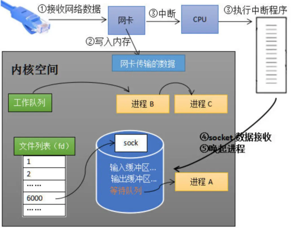

唤醒进程的过程如下图所示：

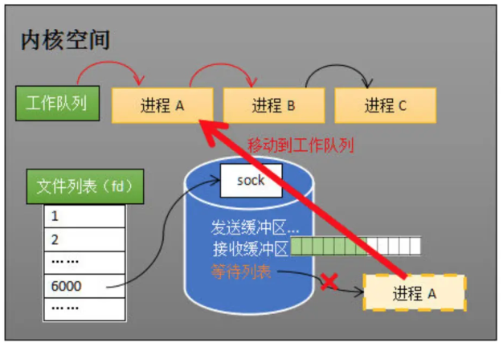

以上是内核接收数据全过程，这里我们可能会思考两个问题：

- 其一，操作系统如何知道网络数据对应于哪个 socket？
- 其二，如何同时监视多个 socket 的数据？ 

第一个问题：因为一个 socket 对应着一个端口号，而网络数据包中包含了 ip 和端口的信息，内核可以通过端口号找到对应的 socket。当然，为了提高处理速度，操作系统会维护端口号到 socket 的索引结构，以快速读取。

第二个问题是多路复用的重中之重，也正是本文后半部分的重点。

### 五、同时监视多个 socket 的简单方法

服务端需要管理多个客户端连接，而 recv 只能监视单个 socket，这种矛盾下，人们开始寻找监视多个 socket 的方法。**epoll 的要义就是高效地监视多个 socket**。

从历史发展角度看，必然先出现一种不太高效的方法，人们再加以改进，正如 select 之于 epoll。

先理解不太高效的 select，才能够更好地理解 epoll 的本质。

假如能够预先传入一个 socket 列表，如果列表中的 socket 都没有数据，挂起进程，直到有一个 socket 收到数据，唤醒进程。这种方法很直接，也是 select 的设计思想。

为方便理解，我们先复习 select 的用法。在下边的代码中，先准备一个数组 fds，让 fds 存放着所有需要监视的 socket。然后调用 select，如果 fds 中的所有 socket 都没有数据，select 会阻塞，直到有一个 socket 接收到数据，select 返回，唤醒进程。用户可以遍历 fds，通过 FD_ISSET 判断具体哪个 socket 收到数据，然后做出处理。

```
int s = socket(AF_INET, SOCK_STREAM, 0);  
bind(s, ...);
listen(s, ...);
int fds[] =  存放需要监听的socket;
while(1){
    int n = select(..., fds, ...)
    for(int i=0; i < fds.count; i++){
        if(FD_ISSET(fds[i], ...)){
            //fds[i]的数据处理
        }
    }}
复制代码
```

#### 5.1 select 的流程

select 的实现思路很直接，假如程序同时监视如下图的 sock1、sock2 和 sock3 三个 socket，那么在调用 select 之后，操作系统把进程 A 分别加入这三个 socket 的等待队列中。

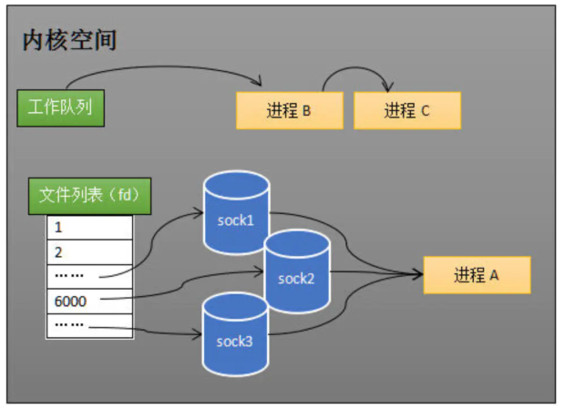

操作系统把进程 A 分别加入这三个 socket 的等待队列中

当任何一个 socket 收到数据后，中断程序将唤起进程。下图展示了 sock2 接收到了数据的处理流程：

注：recv 和 select 的中断回调可以设置成不同的内容。

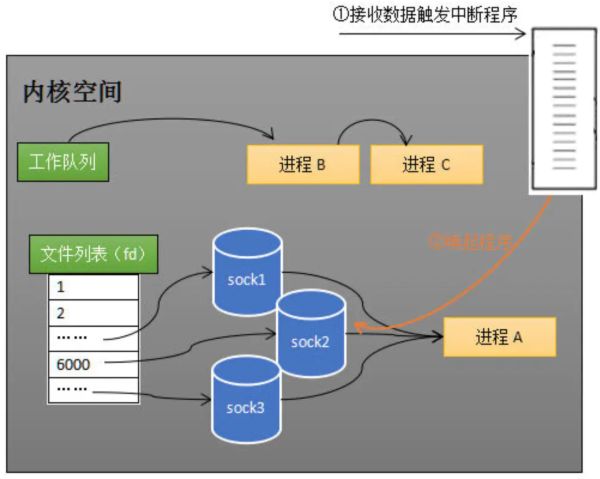

sock2 接收到了数据，中断程序唤起进程 A。所谓唤起进程，就是将进程从所有的等待队列中移除，加入到工作队列里面，如下图所示：

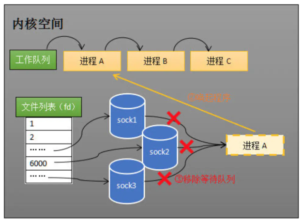

将进程 A 从所有等待队列中移除，再加入到工作队列里面。

经由这些步骤，当进程 A 被唤醒后，它知道至少有一个 socket 接收了数据。程序只需遍历一遍 socket 列表，就可以得到就绪的 socket。

这种简单方式行之有效，在几乎所有操作系统都有对应的实现。

但是简单的方法往往有缺点，主要是：

其一，每次调用 select 都需要将进程加入到所有监视 socket 的等待队列，每次唤醒都需要从每个队列中移除。这里涉及了两次遍历，而且每次都要将整个 fds 列表传递给内核，有一定的开销。正是因为遍历操作开销大，出于效率的考量，才会规定 select 的最大监视数量，默认只能监视 1024 个 socket。

其二，进程被唤醒后，程序并不知道哪些 socket 收到数据，还需要遍历一次。

那么，**有没有减少遍历的方法？有没有保存就绪 socket 的方法？这两个问题便是 epoll 技术要解决的。**

补充说明： 本节只解释了 select 的一种情形。当程序调用 select 时，内核会先遍历一遍 socket，如果有一个以上的 socket 接收缓冲区有数据，那么 select 直接返回，不会阻塞。这也是为什么 select 的返回值有可能大于 1 的原因之一。如果没有 socket 有数据，进程才会阻塞。

### 六、epoll 的设计思路

epoll 是在 select 出现 N 多年后才被发明的，是 select 和 poll（poll 和 select 基本一样，有少量改进）的增强版本。epoll 通过以下一些措施来改进效率：

#### 6.1 措施一：等待队列分离

select 低效的原因之一是将“维护等待队列”和“阻塞进程”两个步骤合二为一。如下图所示，每次调用 select 都需要这两步操作，然而大多数应用场景中，需要监视的 socket 相对固定，并不需要每次都修改。epoll 将这两个操作分开，先用 epoll_ctl 维护等待队列，再调用 epoll_wait 阻塞进程。显而易见地，效率就能得到提升。


相比 select，epoll 拆分了功能。

为方便理解后续的内容，我们先了解一下 epoll 的用法。如下的代码中，先用 epoll_create 创建一个 epoll 对象 epfd，再通过 epoll_ctl 将需要监视的 socket 添加到 epfd 中，最后调用 epoll_wait 等待数据：

```
int s = socket(AF_INET, SOCK_STREAM, 0);   
bind(s, ...)
listen(s, ...)

int epfd = epoll_create(...);
epoll_ctl(epfd, ...); //将所有需要监听的socket添加到epfd中

while(1){
    int n = epoll_wait(...)
    for(接收到数据的socket){
        //处理
    }
}
复制代码
```

功能分离，使得 epoll 有了优化的可能。

#### 6.2 措施二：就绪列表

select 低效的另一个原因在于程序不知道哪些 socket 收到数据，只能一个个遍历。如果内核维护一个“就绪列表”，引用收到数据的 socket，就能避免遍历。如下图所示，计算机共有三个 socket，收到数据的 sock2 和 sock3 被就绪列表 rdlist 所引用。当进程被唤醒后，只要获取 rdlist 的内容，就能够知道哪些 socket 收到数据。

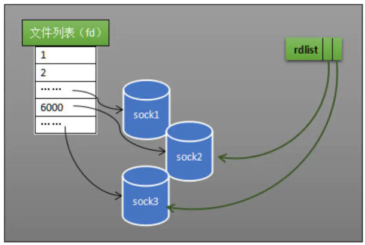

### 七、epoll 的原理与工作流程

本节会以示例和图表来讲解 epoll 的原理和工作流程。

#### 7.1 创建 epoll 对象

如下图所示，当某个进程调用 epoll_create 方法时，内核会创建一个 eventpoll 对象（也就是程序中 epfd 所代表的对象）。eventpoll 对象也是文件系统中的一员，和 socket 一样，它也会有等待队列。

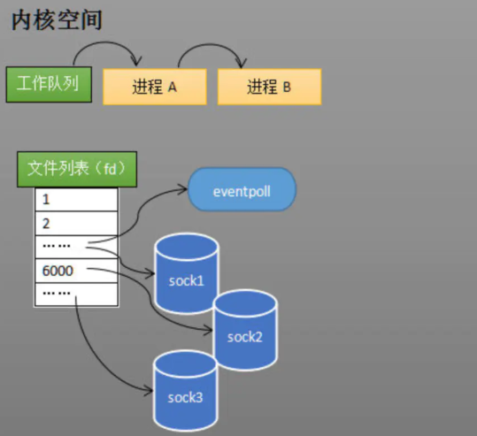

创建一个代表该 epoll 的 eventpoll 对象是必须的，因为内核要维护“就绪列表”等数据，“就绪列表”可以作为 eventpoll 的成员。

#### 7.2 维护监视列表

创建 epoll 对象后，可以用 epoll_ctl 添加或删除所要监听的 socket。以添加 socket 为例，如下图，如果通过 epoll_ctl 添加 sock1、sock2 和 sock3 的监视，内核会将 eventpoll 添加到这三个 socket 的等待队列中。

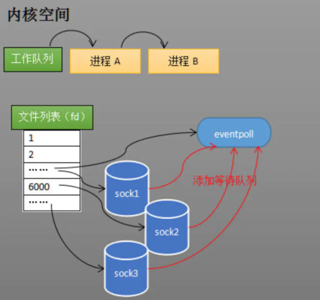

当 socket 收到数据后，中断程序会操作 eventpoll 对象，而不是直接操作进程。

#### 7.3 接收数据

当 socket 收到数据后，中断程序会给 eventpoll 的“就绪列表”添加 socket 引用。如下图展示的是 sock2 和 sock3 收到数据后，中断程序让 rdlist 引用这两个 socket。

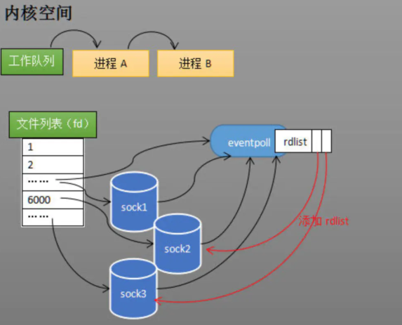

eventpoll 对象相当于 socket 和进程之间的中介，socket 的数据接收并不直接影响进程，而是通过改变 eventpoll 的就绪列表来改变进程状态。

当程序执行到 epoll_wait 时，如果 rdlist 已经引用了 socket，那么 epoll_wait 直接返回，如果 rdlist 为空，阻塞进程。

#### 7.4 阻塞和唤醒进程

假设计算机中正在运行进程 A 和进程 B，在某时刻进程 A 运行到了 epoll_wait 语句。如下图所示，内核会将进程 A 放入 eventpoll 的等待队列中，阻塞进程。

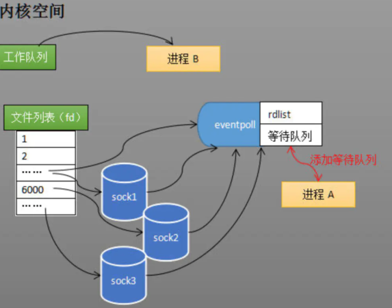

当 socket 接收到数据，中断程序一方面修改 rdlist，另一方面唤醒 eventpoll 等待队列中的进程，进程 A 再次进入运行状态（如下图）。也因为 rdlist 的存在，进程 A 可以知道哪些 socket 发生了变化。

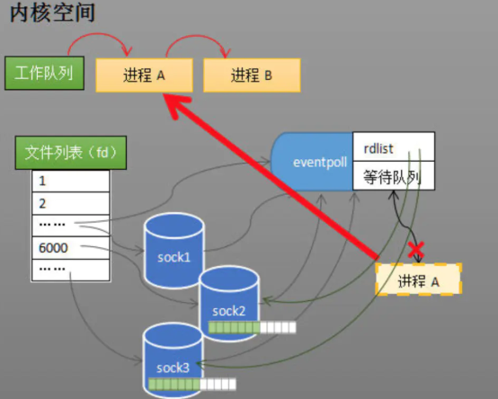

### 八、epoll 的实现细节

至此，相信读者对 epoll 的本质已经有一定的了解。但我们还需要知道 eventpoll 的数据结构是什么样子？

此外，就绪队列应该应使用什么数据结构？eventpoll 应使用什么数据结构来管理通过 epoll_ctl 添加或删除的 socket？

eventpoll 包含了 lock、mtx、wq（等待队列）与 rdlist 等成员，其中 rdlist 和 rbr 是我们所关心的。

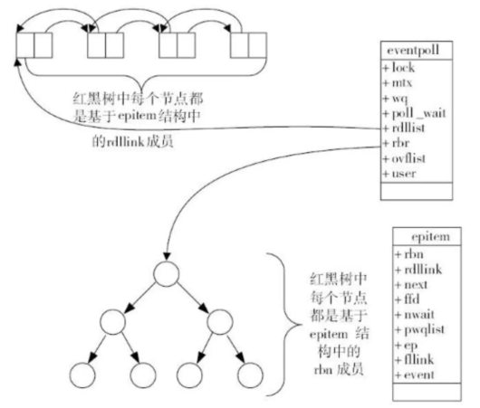

epoll 原理示意图，图片来源：《深入理解Nginx：模块开发与架构解析(第二版)》，陶辉

#### 8.1 就绪列表的数据结构

就绪列表引用着就绪的 socket，所以它应能够快速的插入数据。

程序可能随时调用 epoll_ctl 添加监视 socket，也可能随时删除。当删除时，若该 socket 已经存放在就绪列表中，它也应该被移除。所以就绪列表应是一种能够快速插入和删除的数据结构。

双向链表就是这样一种数据结构，epoll 使用双向链表来实现就绪队列（对应上图的 rdllist）。

#### 8.2 索引结构

既然 epoll 将“维护监视队列”和“进程阻塞”分离，也意味着需要有个数据结构来保存监视的 socket，至少要方便地添加和移除，还要便于搜索，以避免重复添加。红黑树是一种自平衡二叉查找树，搜索、插入和删除时间复杂度都是O(log(N))，效率较好，epoll 使用了红黑树作为索引结构（对应上图的 rbr）。

注：因为操作系统要兼顾多种功能，以及由更多需要保存的数据，rdlist 并非直接引用 socket，而是通过 epitem 间接引用，红黑树的节点也是 epitem 对象。同样，文件系统也并非直接引用着 socket。为方便理解，本文中省略了一些间接结构。

### 九、小结

epoll 在 select 和 poll 的基础上引入了 eventpoll 作为中间层，使用了先进的数据结构，是一种高效的多路复用技术。这里也以表格形式简单对比一下 select、poll 与 epoll，结束此文。希望读者能有所收获。

