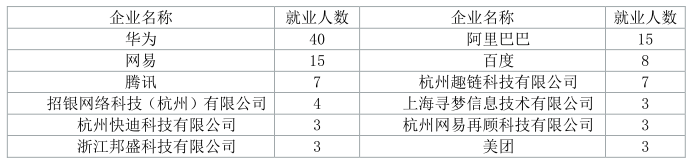
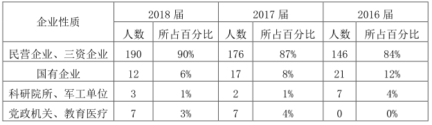
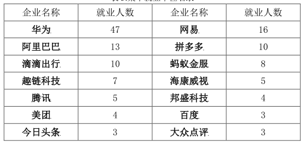

2020年5月18日 10:05:22

### 目录

1. 个人春招实习情况汇总
2. 学校历年就业情况统计
3. 本专业就业岗位分析
4. 总结和指导建议

### 1. 个人春招实习情况汇总

#### 1.1 实习时间历程

2020年春节是1月25号，由于怕肺炎疫情封锁道路，就在1月27号回杭州了，也没有去上海。到杭州就开始封路检查了。还好回来的早，不然要隔离14天。到了2月3号，实习群里就开始疯狂发实习信息。几乎包含了阿里的各个事业群部门线。我当时第一感觉就是晚了，要赶紧学习了。

然后开始学习Java基础知识，Java SpringMVC架构等，当时不知道目标是什么，也不知道会面试什么。

看到别的同学投简历就心急，心态很不好，既怕自己落后了想投，又怕自己没准备好不敢投。一直是焦灼的学习，以备考的心态和方式学习知识点，不去深究，不去实战，给后面面试埋下了失败的种子。

大概2月20号，有个师兄加我微信，帮我修改简历，然后给我预面了一下。我才知道自己差了很多，很多知识都不会，都没有学到。对技术有追求，这句话，我第一次听到并感到很不解，以为知识面要广。

经历这一面后，开始广学Java知识，当时一直在Java官网上看英文文档。现在想想真是傻了，不仅浪费了宝贵的时间，还学不到什么知识，就开始学习 github 上 Javacore 知识。

大概到3月初，等的急了就投了两个部门，开始面试之旅。很快就有回应，先是天猫的后是CCB的，问了很多有深度的知识点，比如底层原理，如何实现的等。没有深入学习，败下阵来。对技术有追求，这句话，第二次听，现在感觉不仅要知识面广，还要有深度，知道底层原理和实现。

经历这两面，娴熟了很多，对面试也淡定了，不再焦急和紧张了。开始深入学习 Java 知识点，手敲代码调试看源码，准备各种常见常问知识点。

大概在3月18号，阿里开始正式内推。当时有两个内推机会，一个是在菜鸟老学长的，一个是供应链的。我没有认真仔细选择，听了供应链的电话就选了他，现在后悔中。不熟悉的人内推就是灾难。

内推后，就安排笔试和测试了，渐渐消息就少了。从内推开始到4月初面试，这段时间心里有其他事情，不能专心备战，但也没有再收到任何面试，就一直等着笔试。我算法能力为什么这么差? 差就算了，还不好好刷题，导致笔试两个0，没有一分。测试里很多快速反应快速计算的题目，我第一次做，还是饭后立刻做，脑子都转不动了，结果也是惨的不行。最后才知道是公务员考试中的行测。

大概在4月6号，供应链的打电话面试。中间清明节回家了，连续开了两天车，不知道为什么整个人都异常了，大脑不好使。然后进入面试不在状态，上来就问JVM如何调优，分布式中间件等。我就感觉不行了。又一次失败，这次是差的最多的。

后面我赶紧学习这些知识，在腾讯课堂学了Redis等等，马士兵讲的确实很好，值得多听几遍。中间有很多机会都因为太集中阿里而错失了。失败了，才知道机会难得。由于是内推，还有一次补救机会，让本地生活捞了。

大概在4月27号，本地生活面试，面试很还行，先是基础知识，然后是JVM调优等。最后搞了个在线编程。当时算是通过了等二面消息。开心的去过五一了。

5月3号，字节笔试，差，5月6号，拼多多笔试，差。笔试为什么这么差？没有任何面试消息了。

最后就是5.12灾难日了。

#### 1.2 面试经过细节

一开始 Java 基础知识+广度，再然后是 Java 基础知识底层实现原理+JVM调优

最后就是分布式中间件这些，比2月份他们初面难多了，还不好过。

很多知识点都是我面后才学才会的，完全比面试慢半拍，导致很多面试都差。

#### 1.3 5月12灾难日

先是本地生活问我是否工作后考研，我说是并说明原因，没有任何联系。然后是小桔车服对我工作后考研表示鄙视。最后是华为主管面试不通过，牛客查了一下华为卡年龄。

我的情况工作后考研，92年的28岁，三个希望同时破灭。当时内心心如刀割，无缘无故被人刷。

#### 1.4 能力和项目问题

首先，工作的三年给我是减分的，没有任何亮眼的项目，完全拿不上台面。感觉以后秋招都麻烦。

其次，我在邮电公司的实习不是偏Java的，秋招会以不对口拒掉。

能力上是不足的，比如现在 Java 基本知识点的笔记还没有写完！高阶的 Java 知识还在学习中。

对岗位理解不深刻，以为只是会 Java 知识就能胜任，Java 知识仅仅是一门语言呀，后端范围太广了。

后端还有分布式知识，云容器知识，大数据这些，需要细化方向。

#### 1.5 启迪、收获、总结

对自己的全面认识：半路转行的大龄程序员，算法不扎实，408不扎实，Java基础不扎实，研究没有论文没有获奖，项目烂的不行。如果不是看浙大研究生，估计都不给面试！

跟面试过招，我感觉与他们差距很远，从专业技能和思维能力都差很远。比如代码分享功能，居然没有压测，被问的一无是处，像个学生项目。

思维能力被什么东西阻碍或损害了，比如性生活，性幻想，恋物，意淫幻想这些损害脑细胞的事情。导致我在测试，笔试，面试上发挥的很不满意。这也给我带了了自卑，面试没有自信。

我的职业生涯也在摇摆，分不清方向，比如一股脑找Java大厂，其实没有什么竞争力，没有什么方向。后端很多方向可以学很多，比如分布式，docker容器等，不要在java上沦陷。

总结就是，必须要来一次深入的从0开始的学习，必须要管好自己的大脑，必须要严格要求自己努力奋斗。对自己放松就是对自己不负责，对未来美化生活破坏！

经历了2019年，整个人都跟市井小人一样，完全不像是研究生，不像是程序员，不像是浙大人。看了郑强教授的演讲，我发现了自己的缺点金钱至上，为了赚钱什么都想。我要从现在开始改变！

### 2. 学校历年就业情况统计

#### 2.1 2017年

2017 届毕业生就业以企业为主，其中民营企业、三资企业共 176 人，占 87%；国有企业 17 人，占 8%；科研院所、军工单位共 2 人，占 1%，党政机关、教育医疗单位共 7 人，占 4%。 

#### 2.2 2018年

#### 2.3 2019年

2019 届毕业生中到军工企业就业的有 1 人，选调生就业的有 1 人。

#### 2.4 2020年

我这届招聘情况。

#### 2.5 学校就业统计小结

从就业范围来看大多去了名企名厂，但是多年后发展情况？其他非名企一共才20多人。

靠公务员或选调的就更少了，个位数吧，不过看今年环境，加上互联网不友好，2020会剧增。

在民企中趣链科技一直很多人。去银行的也少，基本都去互联网这些企业。

### 3. 本专业就业岗位分析

#### 3.1 互联网行业

经历过春招实习，发现行业要求很高，要算法+强项目+年轻的。在加上我看了阿里996和361制度就没有去阿里的期望了，阿里在外行人眼里光鲜无数，其实内部很鸡贼，比国企还严重的勾心斗角。

我如果去民企，就去待遇好的，钱少没事，发展好的，比如正在融资的公司，向上发展的公司等。

其实想去大厂也难，算法一关我就很难过，即使过了还要嫌弃我年龄，工作后考研等。

#### 3.2 传统国企行业

杭州是真的少，北京国企，上海外企，杭州只剩下民企了，怪不得拼命发展互联网，不然真没得发展了。

想在杭州找国企，找到了也是996环境，还不如到互联网加班，拿的钱还多。

主要是看不到招聘信息，很少有企业招聘。

电力：国家电网（当地分公司），国家电网科学院（南瑞集团），电网子公司等。

发电：四大发电集团：大唐集团科学院，华润集团，神华集团，中国核电等，也招计算机的，待遇自行咨询。

铁路，航空公司：铁路局，航空公司等也有招聘。中国铁道科学院等。

医院：有两名同学去了医院的信息部，一般有医院事业单位编制。待遇中等。

三大运营商：中移杭研（23W），中移苏研（23w），中移互联网，中移在线这几个是待遇比较好的。

龙湖地产科技部（今年给30W）。

#### 3.3 银行研究院事业单位

各银行人员招聘还是蛮多的，去年很多招牌信息。

网上有人反映银行也嫌年龄大，那个可是18年92的才26岁。

牛客有实习的人说了，年龄28一下，可以非本985硕，机会瞬间增大。

银行面试要穿正装。

监管机关：“一行三会”中国人民银行，银监会，保监会，证监会（编制，待遇中等，涨薪不明朗，适合追求轻松稳定，建议去省会及以上部门）

政策性银行：国家开发银行，进出口银行，中国农业发展银行（待遇较好，无存款压力，忙碌中等，省行难进，县行好进不建议去）

国有银行和商业银行：中农工建+邮政/招行，平安，浦发，广发，中信等各大行总行以及总行直属的软件开发部门,信用卡中心等

“银行”种类各有不同，部门差异也非常大。有中央银行，政策性银行，商业银行等等。总体来说，对技术要求不是特别高，看重学历，看重口才和形象多一点点，也不绝对，具体还要看你去哪个银行的什么部门.

银行方面，还是首推三大政策性银行，待遇极高，地位高，没什么压力。央行待遇一般，但是有编。
如果去商业银行的话，农行数据中心，银联，招银网络，浙商银行金融科技部，浦发金融科技待遇拘束哦都行，25-28万应该差不多。
银行招聘喜欢学历好的，笔试面试都相对简单，不用太担心，不要错过了报名就行。

#### 3.4 公务员选调生

5月20号，有直播，到时详细总结。

选调生热度很大，去学校论坛问问，很多都是一边秋招一边备考，所以一定要两手抓，不能走一条死路。

国考11月份，选调生12月份，省考3到5月份。

#### 3.5 就业岗位小结

优先银行证券，而后国企，再后老师公司，最后互联网企业。

复习建议：两个方向，公务员的重点是行测+申论，国企类的行测+简单的技术（许多面试官不懂技术，吹项目就行，自己能讲出来做了什么就行，有的国企也会问技术，总体来说不难）,互联网公司要扎实的技术（技术笔试，技术面试，项目经验，手写代码等）

### 4. 总结和指导意见

#### 4.1 总结

工作不是为了挣钱，工作是顺带挣钱。我到公司去就要起到带头作用，起到中流砥柱作用，起到浙大985作用。

这样才能在工作中越战越勇，迎接新的挑战。在学习上，不至于陷入备考求过状态。

两套方案并行，一边学知识，一边备考公务员。

#### 4.2 指导意见

- 多投多尝试，不要盯着最想去的那家，工作都差不多，没有绝对好坏，用骑驴找马的思想，先有个保底的，然后继续挑战，找工作运气和能力都很重要，眼缘重要，相信总有好机会在等自己；
- 边学边找，边面试边补充、不要想学完再找（复习的时候，建议直接看面经，然后扩展，不要从书的第一页开始翻）
- 把握机遇，提前准备，纵有一身能力错过了招聘时间也没办法，或者人招够了HC没了也没办法，先到先得，先到的容易点，后面越卡越严格
- 形象内在都稍微重视一些，显得精干些，国企银行之类的比较看重形象
- 技术类的话要擅长一门语言，不需要太多，但是熟悉一种5.无论什么工作，最好沾点技术的，比如不要干银行的零售之类的，完全丢掉了自己的优势，学木匠却干了铁匠活。
- 无论什么工作，最好沾点技术的，比如不要干银行的零售之类的，完全丢掉了自己的优势，学木匠却干了铁匠活。
- 有些互联网公司笔试是一个筛选流程但不是必要流程，急要人或者有朋友在里面，有时候直接面试用人，跳过麻烦的笔试，但国企笔试是必要流程。

### 问问自己

如果给你个项目，让你设计一下数据库或框架，你能搞定吗? 你能搞定这些？