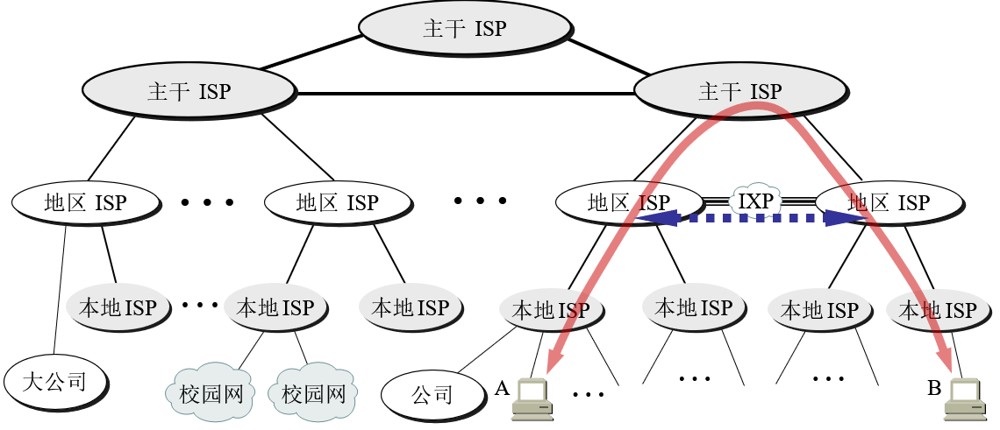

2020年5月19日 08:24:58

### 目录

1. 互联网三个阶段
2. 互联网组成
3. 互联网类别
4. 计算机网络能指标及特征
5. 计算机网络体系结构

### 1. 互联网三个阶段

#### 1.1 第一阶段：ARPANET

1969年在美国诞生的第一个互联网，国家性质的局部网络结构。因为多个机构使用，演变为更大网络。

#### 1.2 第二阶段：三级结构

1985年美国NSF建立的结构化网络，给更多的机构使用，即主干网、地区网、校企网。因为互联网普及，用户数剧增，近靠国家管理无法满足其扩展的速度。

#### 1.3 第三阶段：多层次 ISP 结构

提供互联网服务的主体由政府变成了商业公司，即互联网服务提供商 ISP。他们提供了接入、IP租赁、路由转发等服务。多层次体现在：本地 ISP，地区 ISP，主干 ISP等多个层次。

#### 1.4 小结

互联网的演变是为了满足更多人入网，形成了现在复杂的物理分层结构。比如入网本地联通运行商，本地联通又接入了华东联通，华东联通接入中国联通，中国联通接入亚洲网络，亚洲网络接入美国网络中心，最后才能访问 YouTube。

为了提高效率，地区 ISP 之间会建立 IXP 互联网交换点，这样就可以形成一个大的局域网，而不对外访问，且联通可以访问电信的。

### 2. 互联网组成

#### 2.1 分为核心部分与边缘部分

- 边缘部分：用户直接使用的
  - 进程间通信
  - C/S服务模式
  - P2P模式
- 核心部分：为边缘部分提供服务（连通与交换）
  - 路由器（分组交换，转发收到的分组）
  - 交换机（电路交换，链路层）

#### 2.2 电路交换

建立起互联网是为了通信传输数据，这就要涉及数据的交换和转发。

对电信网而言，电话出现时也需要数据交换，但是电话不可能都是一对一的专线。所以出现了电路交换的方式，即所有电话接入到交换机中，让接线员临时从电路上接通一条线路让两者通话。电路交换就是共用电话线来通信。

电路交换很明显切换时间长，且线路利用率低（很多线路接通后不是一直有数据传输），需要改进。

#### 2.3 分组交换

发送一块数据叫报文，把报文按一定大小分为多个数据段，并加上首都，就叫做分组（package），也叫做包。

其实分组就是一个首部+数据段。所以路由器交换分组就是交换报文的一部分数据。

分组交换采用存储转发技术，把分组发送到路由器后并不是直接转发，而是根据网络的情况（拥塞等）选择合适的路径再转发（转发表找端口），这期间会把分组存储在路由器内存中。

分组交换很明显会产生时延，由于线路共用还会产生丢包、粘包问题等。

还有一个是报文交换，即不对报文分组直接交换，其延时更长。

### 3. 互联网类别

WAN、MAN、LAN、PAN

### 4. 计算机网络能指标及特征

#### 4.1 速率

即二进制比特每秒传输量，单位是bps（bit per second）。

#### 4.2 带宽

分为频域带宽（每秒通过的频率范围赫兹）和时域带宽（即速率）。

#### 4.3 吞吐量

单位时间内通过网络的实际数据量。比如 Java 处理一个 Http 请求的吞吐量等。时间不一定是每秒，传输单位不一定是比特，可以是字节或帧等。

#### 4.4 时延

总时延 = 发送时延 + 传播时延 + 处理时延 + 排队时延

- 发送时延（主机或路由器发送数据帧所需要的时间）= 数据帧长度 / 发送速率
- 传播时延（电磁波在信道中传播耗时）= 信道长度 / 传播速率
- 处理时延（处理分组的时间，包括获取端口和目的地 IP等）
- 排队时延（由于分组交换采用存储转发技术，会产生排队情况）

#### 4.5 时延带宽积

时延带宽积 = 传播时延 X 带宽（以比特为单位的链路长度）。

类似求圆柱体的体积，表示这个链路能容纳多说 bit。

#### 4.6 往返时间 RTT

通信是双向的，需要计算两者的来回时间，可以更全面准确判断真实传输速率。

有效数据率 = 数据长度 / (发送时间+RTT)

#### 4.7 利用率

即信道使用率，一段时间传输数据与不传输数据空闲所占时间比。

### 5. 计算机网络体系结构

#### 5.1 五层网络协议

对比OSI 协议和 TCPIP 协议，采用折中的五层网络协议。

协议：包括语法、语义、同步。

- 应用层：DNS，SMTP，HTTP，FTP （报文）
- 运输层：TCP（报文段），UDP（用户数据报）
- 网络层：IP（分组或数据报）
- 数据链路层：（帧）
- 物理层：（比特）

